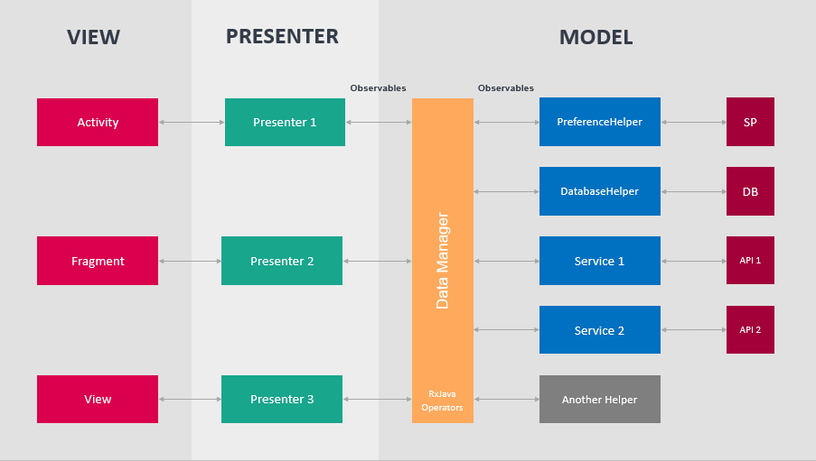
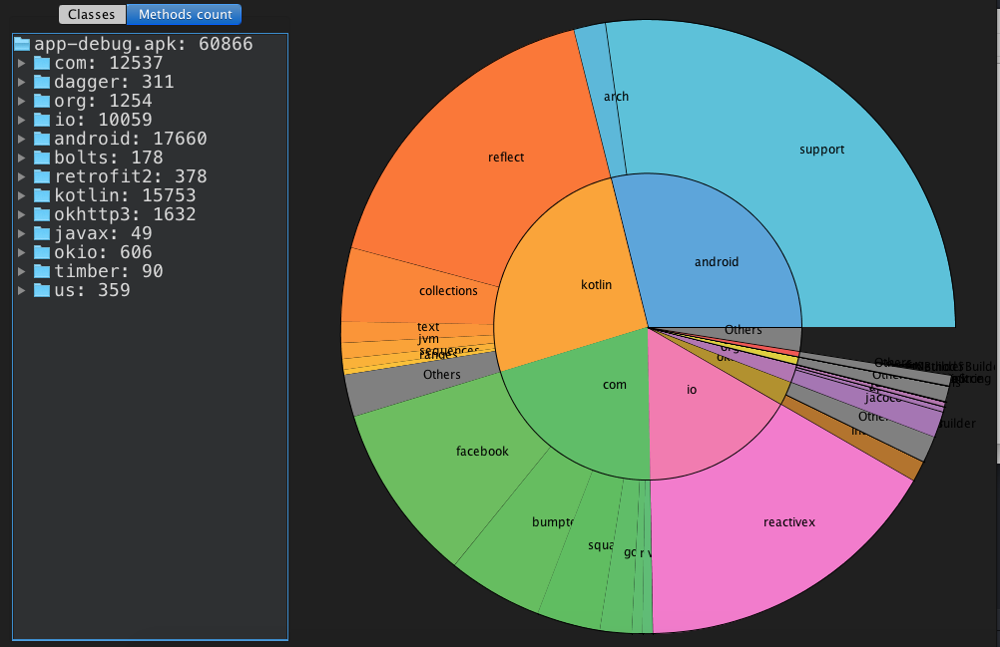

# MVVM + LiveData + Room

Languages, libraries and tools used

- [Kotlin](https://kotlinlang.org/)
- [RxJava](https://github.com/ReactiveX/RxJava) and [RxAndroid](https://github.com/ReactiveX/RxAndroid) 
- Dependency Injection with [Dagger 2](http://google.github.io/dagger/)
- [Room](https://developer.android.com/topic/libraries/architecture/room.html) Persistence Library
- Network communication with [Retrofit 2](http://square.github.io/retrofit/)
- [Stetho](http://facebook.github.io/stetho/) as debug bridge
- Image loading and caching with [Glide](https://github.com/bumptech/glide)
- [Timber](https://github.com/JakeWharton/timber)
- [Espresso](https://google.github.io/android-testing-support-library/docs/espresso/index.html)
- [Robolectric](http://robolectric.org/)
- [Mockito](http://mockito.org/)
- [DexOpener](https://github.com/tmurakami/dexopener)
- [Detekt](https://arturbosch.github.io/detekt/) Static Code Analyzer
- [Moshi](https://github.com/square/moshi) JSON Serialization


## Features

* Displays CryptoCurrency stats using [CoinMarketCap API](https://coinmarketcap.com/api/) with offline first approach.
See [Carlos Daniel's article](https://medium.com/@cdmunoz/offline-first-android-app-with-mvvm-dagger2-rxjava-livedata-and-room-25de4e1ada14) for more details.


## TODO 2020

- [ ] DiffUtils
- [ ] Paging
- [ ] WorkManager
- [ ] MotionLayout
- [ ] Compose
- [ ] Navigation
- [ ] 60% Unit Test Coverage

## Requirements

- JDK 1.8
- Android Studio 3
- [Android SDK](http://developer.android.com/sdk/index.html)
- Android Oreo [(API 27)](http://developer.android.com/tools/revisions/platforms.html)
- Latest Android SDK Tools and build tools.


## Architecture

This project follows Android architecture guidelines that are based on MVVM.



## Code Analysis by Cloc

```
-------------------------------------------------------------------------------
Language                     files          blank        comment           code
-------------------------------------------------------------------------------
Kotlin                          20            132             82            539
XML                             15             19              3            251
-------------------------------------------------------------------------------
SUM:                            35            151             85            790
-------------------------------------------------------------------------------

```

## Method Count by ClassyShark




## License

```
    Copyright 2018 Ege Kuzubasioglu

    Licensed under the Apache License, Version 2.0 (the "License");
    you may not use this file except in compliance with the License.
    You may obtain a copy of the License at

       http://www.apache.org/licenses/LICENSE-2.0

    Unless required by applicable law or agreed to in writing, software
    distributed under the License is distributed on an "AS IS" BASIS,
    WITHOUT WARRANTIES OR CONDITIONS OF ANY KIND, either express or implied.
    See the License for the specific language governing permissions and
    limitations under the License.
```
